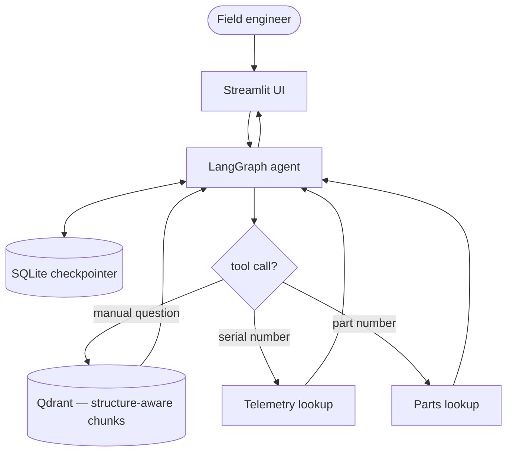

# ⚡ VoltPro Diagnostic Copilot

An agentic troubleshooting assistant for an industrial hybrid inverter (the
fictional "VoltPro-X9000"). Instead of a plain chatbot bolted onto a PDF, it
combines three things in one conversation: the equipment's service manual
(RAG), live device telemetry, and a spare-parts inventory lookup — so it can
tell you *why* an error happened, *whether the affected unit is online right
now*, and *what part to order*, without you tabbing between three systems.

Built with **LangGraph**, **Qdrant**, and **Streamlit**.

## Why this exists

Field technicians and support desks lose real time flipping through
100+ page PDF manuals during an outage. This project is a working example
of what that support experience looks like when it's grounded in an actual
document instead of a model's general knowledge — including the harder
part: knowing when to say "this isn't in the manual" instead of guessing.

## What it actually does

- Answers error-code and spec questions from the manual, with the source
  section and error code attached to each retrieved chunk (not just raw
  text — see `core/tools.py`).
- Looks up live telemetry (temperature, alarms, grid status) by serial
  number, and spare-part stock/pricing by part number.
- Is instructed, and mostly does, decline to answer when something isn't in
  the retrieved context rather than inventing a number — see the honest
  results in the benchmark section below, including where this currently
  falls short.
- Keeps per-session conversation history via a LangGraph checkpointer, with
  a simple multi-session sidebar in the Streamlit UI, and summarizes older
  messages once a thread gets long so cost and latency don't grow forever.

## Architecture



The manual isn't chunked by raw character count — `core/tools.py` splits it
on its own structure (`=== SECTION N ===` and `[Error Code E-xxx]`
boundaries) so a full error block stays together instead of getting cut
mid-remediation-step. Each chunk carries its section/error-code as metadata,
which is what lets the agent cite a real source instead of just restating
whatever text it retrieved.

## Guardrails

What's actually implemented, not just described:

- **Scope + prompt-injection resistance:** the system prompt restricts the
  agent to VoltPro-X9000 topics and explicitly tells it to treat tool output
  (including retrieved manual text) as reference data, never as
  instructions — so a manipulated or malicious manual chunk can't hijack
  the agent's behavior.
- **Context growth is bounded:** a `summarize` node runs before every
  model call; once a thread passes 12 messages, everything except the 4
  most recent is collapsed into a short summary (error codes, serials, and
  part numbers are preserved).
- **Tool failures don't crash the run:** `ToolNode` is configured with
  `handle_tool_errors=True` explicitly, rather than relying on the
  library's default — that default has changed between LangGraph releases,
  so a transient Qdrant read failure comes back to the model as an error
  message instead of crashing the whole graph.
- **Recursion is capped:** every invocation sets `recursion_limit=25`, so a
  stuck tool-call loop fails loudly instead of running up API cost
  silently.
- **Mandatory retrieval before refusal:** the system prompt requires a real
  tool call before the model is allowed to say something isn't documented,
  and forbids reusing an earlier turn's refusal for a new question — this
  was added after observing the model skip retrieval and copy a prior
  "not documented" answer for an unrelated follow-up question in the same
  session.

What's *not* implemented, honestly: there's no rate limiting per user, no
retry/backoff wrapper around the OpenRouter call for transient network
failures, and no tracing/observability (e.g. LangSmith or Langfuse) wired
in. All three are reasonable next steps, covered conceptually in
`docs/scaling.md`, but none of them are running code today.

## Benchmark results

From an actual run of `python -m eval.evaluate` against
`eval/golden_dataset.json`, which mixes five questions the manual can answer
with two it deliberately can't (a model number and a maintenance item that
don't appear in this document):

| Query ID | Category | Target | Latency | Status |
|:---|:---|:---|:---:|:---:|
| Q1 | Mechanical Torque | `12.0` | 2.76s | PASS |
| Q2 | Wiring & Pinout | `T-568B` | 2.75s | PASS |
| Q3 | Error Resolution | `AF-901` | 2.98s | PASS |
| Q4 | Spare Parts | `FAN-4412` | 8.6s | PASS |
| Q5 | Live Telemetry | `E-204` | 1.86s | PASS |
| Q6 | Refusal (unanswerable) | `not documented` / `cannot provide` / `only authorized` | 1.1s | PASS |
| Q7 | Refusal (unanswerable) | `not documented` / `does not utilize` / `does not require` | 2.02s | PASS |

**Overall accuracy: 100% (7/7).** All 5 pytest integration tests pass
(`python -m pytest -v`, 13.3s).

Worth explaining the Q6/Q7 history honestly, because it's a more useful
lesson than a clean table: the first run of this benchmark showed both as
FAILED. Reading the actual model output (not just the pass/fail line)
showed the model had answered *correctly* both times —
for Q6 ("what's the max voltage for the VoltPro-X8000?", a model that
doesn't exist) it replied "I am only authorized to provide support for the
VoltPro-X9000... I cannot provide information regarding the X8000 model."
For Q7 ("engine oil change interval?", nonsensical for an inverter) it
replied "the VoltPro-X9000... does not utilize an internal combustion
engine or require engine oil." Both are correct, honest refusals — they
just don't contain the single literal phrase "not documented" that the
original eval script checked for. The bug was in the test, not the model:
`eval/golden_dataset.json` now accepts any of several valid refusal
phrasings per question instead of one hardcoded string.

Seven questions is a small eval set regardless — enough to catch a broken
prompt or a chunking regression, not enough to claim a production-grade
accuracy number.

## Tech stack

- **Orchestration:** LangGraph (`StateGraph`, `ToolNode`, conditional routing)
- **Vector store:** Qdrant, running embedded/local for this demo
- **Embeddings:** `BAAI/bge-small-en-v1.5` via [fastembed](https://github.com/qdrant/fastembed) — runs
  locally on ONNX Runtime, no API key or network call needed at query time. English-only: a Persian
  (or other non-English) question currently retrieves poorly, since the embedding model was never
  trained on that language — this is a known gap, not a bug, and the fix (swapping in a multilingual
  fastembed model) is straightforward if non-English support is ever needed.
- **LLM:** via OpenRouter (currently `google/gemma-4-31b-it`, swappable)
- **Persistence:** `langgraph-checkpoint-sqlite`
- **UI:** Streamlit
- **Tests:** pytest (integration tests — see `tests/test_tools.py`)

## Known limitations

Being upfront about this rather than burying it:

- Embeddings are English-only (see Tech stack above).
- Qdrant runs embedded (`path=./qdrant_storage`), which is a single-process
  file lock — fine for a demo, not for multiple concurrent workers. See
  `docs/scaling.md` for what changes if this needed to handle real traffic.
- Same story for the SQLite checkpointer.
- The eval set is small (7 questions). It exercises the main paths but isn't
  a statistically meaningful accuracy benchmark.
- `lookup_device_telemetry` and `lookup_spare_part` are in-memory dicts, not
  real APIs — they stand in for what would be a live systems-integration
  call in an actual deployment.
- Tests in `tests/test_tools.py` are integration tests: they hit the real
  (local) Qdrant collection, so the knowledge base needs to be indexed first
  (`python -m core.tools`).

## Quickstart

**1. Install**
```bash
git clone https://github.com/mostafa-hakimi/voltpro-diagnostic-copilot.git
cd voltpro-diagnostic-copilot
python -m venv .venv && source .venv/bin/activate  # Windows: .venv\Scripts\activate
pip install -r requirements.txt
```

**2. Configure environment**

Copy `.env.example` to `.env` and fill in your key:
```
OPENROUTER_API_KEY=your_openrouter_api_key
OPENROUTER_BASE_URL=https://openrouter.ai/api/v1
```

**3. Index the manual into Qdrant**
```bash
python -m core.tools
```

**4. Run the tests**
```bash
python -m pytest -v
```

**5. Launch the app**
```bash
streamlit run app.py
```

**Or, with Docker:**
```bash
docker build -t voltpro-copilot .
docker run --env-file .env -p 8501:8501 voltpro-copilot
```

## Scaling this up

`docs/scaling.md` covers the concrete changes for moving off the embedded
Qdrant instance and SQLite checkpointer to something that handles real
concurrent traffic — it's a plan, not something already built here.

## License

MIT
