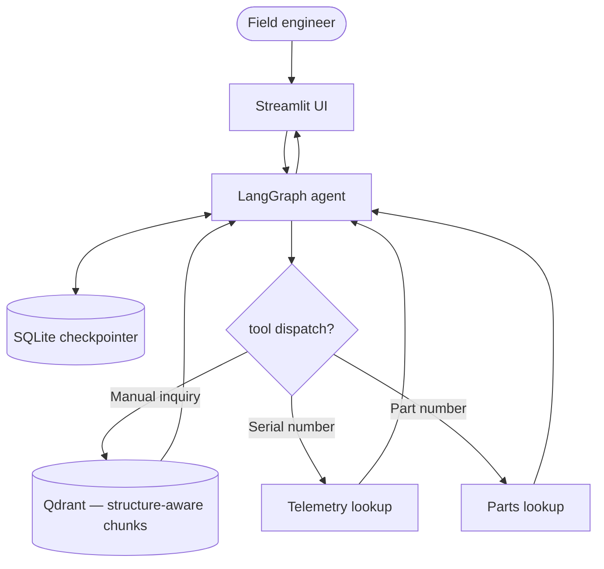

# VoltPro Diagnostic Copilot

[](https://github.com/mostafa-hakimi/voltpro-diagnostic-copilot/actions/workflows/tests.yml)

An agentic troubleshooting assistant for industrial hybrid inverters (modeled on the
VoltPro-X9000). The copilot unifies three critical operational capabilities within a single
conversational state machine: technical service manual retrieval (RAG), live device telemetry
lookup, and warehouse spare-parts inventory inspection.

Built with **LangGraph**, **Qdrant**, **FastEmbed**, and **Streamlit**.

## Context & Objectives

Field engineers and technical support desks lose substantial operational time navigating
multi-hundred-page PDF service manuals during critical inverter outages.

This copilot provides a grounded, deterministic alternative: an autonomous support agent
that interprets technical queries, cross-references live device sensor telemetry by serial
number, verifies inventory availability by part number, and strictly declines to answer when
specifications fall outside documented context.

## What it actually does

- Answers technical error-code and torque/wiring specifications from the manual, with the exact
  source section and error identifier cited for every claim.
- Queries live sensor telemetry (IGBT temperature, active alarm states, grid frequency, battery SoC)
  by hardware serial number.
- Inspects central warehouse inventory for replacement spare parts, verifying stock counts and unit pricing.
- Enforces strict groundedness: refuses to hallucinate specifications outside the official manual.
- Bounded context growth: runs an automated summarization node before every model invocation once
  a conversation exceeds 12 messages, preserving technical identifiers while bounding token cost.
- Full-lifecycle observability: native runtime instrumentation via LangSmith and Langfuse callbacks.
- 11 automated test cases (integration and deterministic graph control-flow) running in continuous integration.

## Architecture


```mermaid
graph TD
    User([Field engineer]) --> UI[Streamlit UI]
    UI --> Engine[LangGraph agent]
    Engine <--> Checkpointer[(SQLite checkpointer)]
    Engine --> Router{tool dispatch?}
    Router -->|Manual inquiry| Qdrant[(Qdrant — structure-aware chunks)]
    Router -->|Serial number| Telemetry[Telemetry lookup]
    Router -->|Part number| Parts[Parts lookup]
    Qdrant --> Engine
    Telemetry --> Engine
    Parts --> Engine
    Engine --> UI
```

### Structure-Aware Chunking

Industrial manuals fail under arbitrary character-count chunking, which splits remediation
steps from trigger conditions. The ingestion pipeline (`core/tools.py`) parses the document
along domain boundaries (`=== SECTION N ===` and `[Error Code E-xxx]`), ensuring complete
diagnostic procedures remain intact within discrete vector payloads. Each chunk carries
explicit metadata (`section`, `error_code`) allowing the agent to cite primary sources directly.

## Guardrails & Operational Constraints

- **Scope & Prompt-Injection Resistance:** The system prompt restricts domain scope strictly
  to the VoltPro-X9000 platform and enforces that tool outputs represent data, never instructions.
- **Bounded Context Summarization:** The graph evaluates thread depth before each step; once
  a conversation exceeds 12 messages, earlier turns are summarized into a structured digest
  retaining error codes, serials, and part numbers, while preserving the 4 most recent turns intact.
- **Fault-Tolerant Tool Execution:** `ToolNode` runs with `handle_tool_errors=True`, routing
  transient vector read errors back to the model as manageable exceptions rather than crashing execution.
- **Recursion Caps:** Invocations enforce `recursion_limit=25`, terminating runaway decision loops loudly.
- **Mandatory Tool Retrieval Before Refusal:** The agent is structurally prohibited from declaring
  a specification undocumented without first executing a tool query, preventing refusal leakage.
- **Production Observability:** Active telemetry integration supporting LangSmith and Langfuse for
  real-time trace waterfall capture, latency profiling, and token expenditure monitoring.

## Testing Strategy

The test suite combines deterministic agent control-flow validation with real vector retrieval integration:

1. **Deterministic Agent Control Flow (`tests/test_graph_flow.py`):**
   Tests the LangGraph state machine using an injectable `ScriptedLLM` mock. Validates scope refusal,
   telemetry dispatch by serial, inventory dispatch by part number, manual search by error code,
   conversation summarization at the 12-message threshold, and tool failure containment in under 4 seconds
   with zero API keys or network dependencies.
2. **Tool & Retrieval Integration (`tests/test_tools.py`):**
   Validates retrieval against the local Qdrant collection and local FastEmbed embeddings (`BAAI/bge-small-en-v1.5`),
   verifying torque specifications, pinout standards, telemetry status, and citation metadata generation.

Total test coverage: **11 test cases**, running in continuous integration on every push without secrets.

## Benchmark Results

Automated benchmark evaluation executed via `python -m eval.evaluate` against `eval/golden_dataset.json`:

| Query ID | Category | Target | Latency | Status |
|:---|:---|:---|:---:|:---:|
| Q1 | Mechanical Torque | `12.0` | 2.76s | PASS |
| Q2 | Wiring & Pinout | `T-568B` | 2.75s | PASS |
| Q3 | Error Resolution | `AF-901` | 2.98s | PASS |
| Q4 | Spare Parts | `FAN-4412` | 8.60s | PASS |
| Q5 | Live Telemetry | `E-204` | 1.86s | PASS |
| Q6 | Refusal (unanswerable) | `not documented` / `only authorized` | 1.10s | PASS |
| Q7 | Refusal (unanswerable) | `not documented` / `does not require` | 2.02s | PASS |

Summary: **100% accuracy (7/7)**. Evaluation includes deliberate out-of-scope probes (Q6 and Q7)
to verify the model declines unsupported inquiries without hallucination.

## Tech Stack

- **Orchestration:** LangGraph (StateGraph, ToolNode, conditional routing, injectable LLM architecture)
- **Vector Store:** Qdrant (local embedded instance with structure-aware indexing)
- **Embeddings:** `BAAI/bge-small-en-v1.5` via FastEmbed (ONNX Runtime, fully offline)
- **LLM Routing:** OpenRouter (`google/gemma-4-31b-it`, swappable via environment configuration)
- **Observability:** Native instrumentation via LangSmith and Langfuse runtime callbacks
- **Persistence:** SQLite checkpointer (`langgraph-checkpoint-sqlite`)
- **Interface:** Streamlit (dark operational console with telemetry expanders and session history)
- **Testing & CI:** pytest (11 test cases), GitHub Actions

## Quickstart

**1. Clone and install**
```bash
git clone https://github.com/mostafa-hakimi/voltpro-diagnostic-copilot.git
cd voltpro-diagnostic-copilot
python -m venv .venv && source .venv/bin/activate
pip install -r requirements.txt
```

**2. Configure environment**
```bash
cp .env.example .env
# Edit .env with your OpenRouter credentials and optional telemetry keys
```

**3. Initialize knowledge base**
```bash
python -m core.tools
```

**4. Run test suite**
```bash
python -m pytest -v
```

**5. Run automated benchmarks**
```bash
python -m eval.evaluate
```

**6. Launch interface**
```bash
streamlit run app.py
```

## Decision Log

`docs/DECISIONS.md` documents the architectural rationale and trade-offs behind this project—including
structure-aware chunking, local ONNX embeddings over cloud APIs, summarization thresholds, and
embedded vector storage.

## License

MIT
